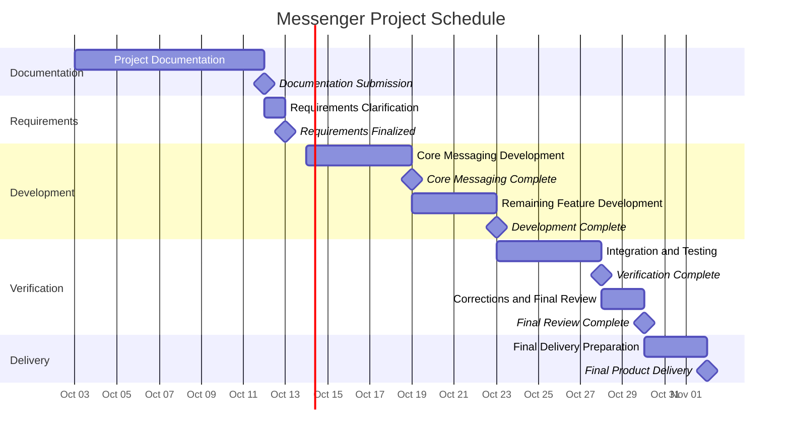

# Statement of Work

**Project:** Messenger Application
**Student:** Sean Hamilton
**Course:** CPS 490 - Capstone I
**Document Status:** Draft

**Submission Date:** October 12, 2026
**Project Delivery Deadline:** November 2, 2026

---

## 1. Project Purpose and Objectives

**Project Purpose**
The purpose of the Messenger project is to develop a communication application that allows multiple existing user identities to communicate through private and group based messaging. The system is intended to provide users with a centralized platform where they can exchange messages individually or participate in conversations involving multiple users. The project will focus on delivering these core communication capabilities while establishing a manageable scope that can be completed within the required project timeline. The initial version of Messenger will be developed as a controlled prototype using existing registered user identities, with the method for accessing those identities requiring further clarification.

**Project Objectives**
The major objectives of the project are:

1. **User Communication:** Allow users with existing identities to exchange private messages and communicate with multiple users through group based messaging.

2. **Group Management:** Allow users to create and manage messaging groups, providing an organized way for multiple users to communicate.

3. **Message Management:** Allow users to view their message history and edit or delete messages they have previously sent.

4. **Notifications:** Provide users with notifications when they receive new messages so they can stay informed about ongoing conversations.

5. **User Profiles:** Allow users with existing identities to maintain basic profiles that identify them within the application.

6. **Project Completion:** Deliver a functional Messenger application that satisfies the agreed upon requirements and can be reviewed and tested before the November 2, 2026, deadline.

## 2. Stakeholders
The Messenger project involves several stakeholders who contribute to its development, define its requirements, or interact with the completed application.

1. **Client:** The client is responsible for communicating the project's expectations, clarifying requirements, and reviewing the completed Messenger application to determine whether it meets the agreed upon objectives.

2. **Software Development Team:** The development team is responsible for designing, developing, integrating, and testing Messenger. The team will also document engineering decisions and ensure the application is ready for final delivery.

3. **Project Manager:** The project manager is responsible for coordinating the development team's activities, monitoring project milestones, managing the schedule, and communicating progress or potential risks to the client.

4. **End Users:** Users with existing identities are the primary users of Messenger. They will use the application to exchange private messages, participate in group conversations, manage their profiles, and interact with the other messaging capabilities.

## 3. Scope

### 3.1 In Scope

The Messenger project will focus on developing the core functionality necessary for multiple existing user identities to communicate through private and group messaging. The application will operate as a controlled prototype without implementing user registration or authentication. The following capabilities are included in the proposed project scope.

1. **User Identification:** Messenger will support multiple existing user identities, each with a unique user ID and basic profile. The method for accessing these identities has not yet been determined and will require clarification before implementation.

2. **Private Messaging:** Users with existing identities will be able to send and receive private messages with other users within Messenger.

3. **Group Messaging:** Users will be able to participate in group conversations involving multiple existing user identities.

4. **Group Management:** Users will be able to create messaging groups and manage group membership.

5. **Message History:** Users will be able to access and view messages from their previous conversations.

6. **Message Editing and Deletion:** Users will be able to edit or delete messages they have previously sent.

7. **Notifications:** Users will receive notifications about new messages. The specific notification method has not yet been determined and will require clarification before implementation.

8. **User Profiles:** Users with existing identities will be able to maintain basic profiles that identify them within Messenger.

9. **Testing and Verification:** The development team will test the agreed upon functionality and verify that the application meets its acceptance criteria before final delivery.

### 3.2 Out of Scope

The Messenger project will focus on delivering its agreed upon communication capabilities. To maintain a manageable project scope and meet the required delivery deadline, the following features will not be included.

1. **Mobile Applications:** The project will not include the development of dedicated applications for mobile devices.

2. **External Application Integration:** Messenger will not support integrations with external applications or third party services.

3. **Advanced Message Encryption:** The project will not include advanced encryption capabilities beyond the standard security protections required for the application.

4. **Voice and Video Calling:** Messenger will focus on text messaging and will not support voice or video communication.

5. **Screen Sharing:** Users will not be able to share their screens with other users through Messenger.

6. **Advanced User Roles and Moderation:** The project will not include advanced permission systems, administrative roles, or moderation tools. Basic group membership management will remain within the project scope.

7. **User Registration and Authentication:** The project will not include account creation, password management, or user authentication. Messenger will support multiple existing user identities, but the method for accessing these identities has not yet been determined and will require clarification before implementation.

## 4. Deliverables
The Messenger project will produce several deliverables throughout its development. These deliverables are organized around two important deadlines: October 12, 2026, for the project documentation and November 2, 2026, for the completed Messenger application.

### 4.1 October 12, 2026: Project Documentation
The following four documents will be completed and submitted to the individual course GitHub repository by October 12, 2026.

1. **Statement of Work:** A document defining the project's purpose, objectives, stakeholders, scope, deliverables, assumptions, constraints, dependencies, schedule, and acceptance criteria.

2. **Requirements Document:** A document defining and analyzing the requirements for the proposed Messenger application.

3. **Diagrams and Analysis:** Documentation containing the required system diagrams and supporting analysis to describe and examine the proposed Messenger system.

4. **Ethics Reflection:** A document examining ethical considerations associated with the proposed Messenger application.

These documents will establish the project's agreed upon expectations and provide a foundation for the remaining development work.

### 4.2 November 2, 2026: Final Product Delivery
The completed Messenger application and its supporting materials will be delivered no later than November 2, 2026. The following deliverables will demonstrate that the agreed upon functionality has been developed and verified.

1. **Functional Messenger Application:** A working application that supports multiple existing user identities, private messaging, group messaging, group management, message history, message editing and deletion, notifications, and basic user profiles. The method for accessing existing user identities will be determined before implementation.

2. **Application Source Code:** The completed source code and supporting configuration files required to build and run the Messenger application.

3. **Testing and Verification Results:** Documented test results demonstrating that the application meets the agreed upon requirements and that its major features function as expected.

4. **Application Documentation:** Documentation explaining how to set up, run, and use the completed Messenger application.

5. **Final Product Demonstration:** A demonstration of the completed application showing that its major communication capabilities operate as intended.

## 5. Assumptions, Constraints, and Dependencies

### 5.1 Assumptions
The following assumptions have been identified for the Messenger project. These conditions will require confirmation as the project progresses.

1. **Existing User Identities:** It is assumed that a set of existing registered user identities will be available for the Messenger prototype. The development team will not be responsible for implementing account registration or authentication.

2. **User Access Method:** It is assumed that an alternative method of accessing existing user identities will be acceptable for the controlled prototype. The specific method requires clarification before implementation.

3. **Notification Method:** It is assumed that a notification method can be selected that satisfies the project's messaging objectives without requiring functionality outside the agreed upon scope. The specific method requires clarification.

4. **Development Resources:** It is assumed that the development team will have access to the necessary development tools and resources to complete the proposed Messenger application within the project timeline.

### 5.2 Constraints

The following constraints establish the boundaries and requirements that the Messenger project must follow.

1. **Project Documentation Deadline:** The Statement of Work, Requirements Document, Diagrams and Analysis, and Ethics Reflection must be completed and submitted to the individual course GitHub repository by October 12, 2026.

2. **Final Product Deadline:** The completed Messenger application must be ready for final delivery no later than November 2, 2026. The development schedule must allow sufficient time for integration, testing, corrections, and final review.

3. **Project Scope:** Development will be limited to the functionality defined in Section 3. Features explicitly excluded from the project will not be included in the initial Messenger prototype.

4. **User Authentication:** The initial prototype will support existing registered user identities without implementing account registration or authentication. This limits the prototype to a controlled environment rather than unrestricted public use.

5. **Repository Requirements:** The required documentation and supporting files must be organized, committed, and pushed to the individual course GitHub repository according to the assignment instructions.

### 5.3 Dependencies

The Messenger project depends on several decisions and resources that may affect development and delivery.

1. **Client Clarification:** The development team depends on the client to clarify unresolved requirements, including how users will access existing identities and how notifications should be delivered. These decisions must be finalized by October 13, 2026, as established in the project schedule, to prevent delays in implementing the affected functionality.

2. **Existing User Identities:** The application depends on the availability of existing registered user identities. The source and method for accessing these identities must be established before implementing the related functionality.

3. **Development Tools and Resources:** The development team depends on having access to the necessary development tools, software, and resources required to build and test Messenger.

4. **Course Repository Access:** Submission of the required project documentation depends on the instructor providing access to the individual course GitHub repository before the October 12 deadline.

## 6. Milestones and Schedule

### 6.1 Project Milestones

The Messenger project will follow a schedule designed to complete
development before the final delivery deadline. This will allow
additional time for integration, testing, corrections, and final review.

The following milestones establish the proposed project timeline.

| Milestone | Target Date | Description |
|---|---|---|
| Project Documentation | October 12, 2026 | Complete and submit the four required project documents. |
| Requirements Clarification | October 13, 2026 | Finalize the user access method, notification method, and remaining implementation requirements. |
| Core Messaging Completion | October 19, 2026 | Complete the primary private and group messaging capabilities. |
| Feature Development Completion | October 23, 2026 | Complete the remaining functionality, including group management, message history, editing, deletion, notifications, and user profiles. |
| Integration and Testing | October 28, 2026 | Complete system integration and verify the agreed upon functionality. |
| Final Review | October 30, 2026 | Complete corrections, review the application, and prepare the final deliverables. |
| Final Product Delivery | November 2, 2026 | Deliver the completed Messenger application and supporting materials. |

### 6.2 Project Gantt Chart
The following Gantt chart illustrates the proposed development schedule for Messenger. It identifies the major project activities, their planned durations, and the milestones leading up to final delivery. The schedule reserves additional time for integration, testing, corrections, and final review before the November 2 deadline.

### 6.3 Activity Dependencies
The Messenger project schedule includes several dependencies that determine when development activities can begin.

1. **Requirements Clarification:** The development team must resolve the outstanding requirements concerning user access and notifications before implementing the affected functionality.

2. **Core Messaging Development:** The primary private and group messaging capabilities must be completed before the remaining features can be fully integrated.

3. **Remaining Feature Development:** Group management, message history, message editing and deletion, notifications, and user profiles must be completed before full system integration and verification.

4. **Integration and Testing:** The completed features must be integrated and tested together to verify that the application meets the agreed upon requirements.

5. **Corrections and Final Review:** Issues identified during testing must be addressed before the final application review.

6. **Final Delivery:** The completed application, source code, testing results, and supporting documentation must be prepared for delivery by November 2, 2026.

## 7. Acceptance Criteria

The Messenger project will be considered complete when the agreed upon deliverables satisfy the following acceptance criteria. These criteria establish how the client and development team will verify that the project objectives have been achieved.

### 7.1 Project Documentation
The documentation deliverables due October 12, 2026, must satisfy the following criteria.

1. **Statement of Work:** The document identifies the project's objectives, stakeholders, scope, deliverables, assumptions, constraints, dependencies, schedule, and acceptance criteria. It also includes a Gantt chart illustrating the proposed development schedule.

2. **Requirements Document:** The document identifies and analyzes the proposed Messenger application's requirements, including its major communication capabilities and relevant constraints.

3. **Diagrams and Analysis:** The required system diagrams and supporting analysis are completed and accurately represent the proposed Messenger application.

4. **Ethics Reflection:** The document addresses ethical considerations associated with developing and using the proposed Messenger application.

5. **Repository Submission:** All four documents and their required supporting files are organized, committed, and submitted to the designated course GitHub repository by October 12, 2026.

### 7.2 Application Acceptance Criteria

The Messenger application must satisfy the following acceptance criteria before final delivery on November 2, 2026.

1. **User Identification:** The application supports multiple existing user identities, each with a unique user ID and basic profile. The agreed upon method for accessing these identities must function as expected. During acceptance testing, the development team will demonstrate that multiple existing user identities can be accessed using the agreed upon method and that each identity is associated with the correct unique user ID and basic profile.

2. **Private Messaging:** Users must be able to send and receive private messages. During acceptance testing, the development team will demonstrate that a message sent from one existing user identity appears in the intended recipient's conversation and can be viewed by that recipient.

3. **Group Messaging:** Users must be able to send and receive messages within a group containing multiple existing user identities. During acceptance testing, the development team will demonstrate that messages sent by different group members appear in the correct group conversation and can be viewed by its members.

4. **Group Management:** Users must be able to create messaging groups and manage group membership. During acceptance testing, the development team will demonstrate that a user can create a group, add members, and remove members. The application must accurately reflect these membership changes.

5. **Message History:** Users must be able to access previous conversations and view messages they have exchanged. During acceptance testing, the development team will demonstrate that a user can leave a conversation, return to it, and retrieve previously exchanged messages in the correct conversation.

6. **Message Editing and Deletion:** Users must be able to edit or delete messages they have previously sent. During acceptance testing, the development team will demonstrate that a user can modify an existing message and verify that the updated content appears in the correct conversation. The team will also demonstrate that a user can delete a previously sent message and verify that it is no longer displayed in the conversation.

7. **Notifications:** Users must receive notifications when new messages arrive. During acceptance testing, the development team will demonstrate that sending a new message triggers a notification for the intended recipient. The specific notification method and behavior must be agreed upon with the client before implementation.

8. **User Profiles:** Users must be able to view and maintain basic profiles that identify them within Messenger. During acceptance testing, the development team will demonstrate that a user can access their existing profile, modify their profile information, and verify that the updated information is correctly displayed.

9. **System Verification:** The development team must demonstrate that the completed Messenger features operate together and satisfy the agreed upon requirements. During acceptance testing, the team will execute documented integration tests covering private messaging, group messaging, group management, message history, message editing and deletion, notifications, and user profiles. The results must be documented, and any unresolved issues must be identified before final delivery.

10. **Final Delivery:** The completed Messenger application, source code, testing results, and supporting documentation must be delivered for client review no later than November 2, 2026. During final acceptance, the development team will demonstrate the application's agreed upon functionality, provide the completed source code and instructions required to build and run the application, and present documented testing results. The client will review these deliverables to determine whether the project satisfies the agreed upon requirements.

